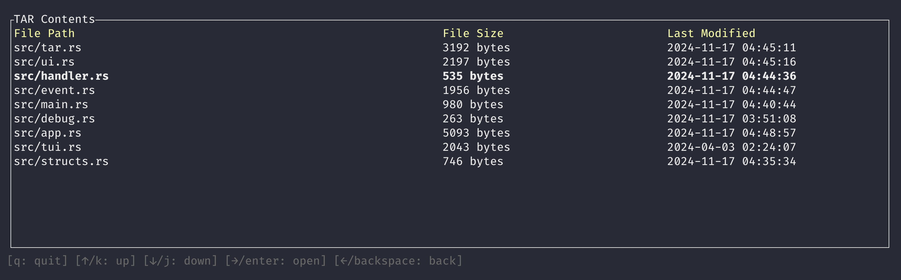

# targ

Work in progress.

A CLI application designed to explore TAR and GZIP-compressed TAR files (tarballs). It allows users to navigate the contents of these archives directly from the terminal.
